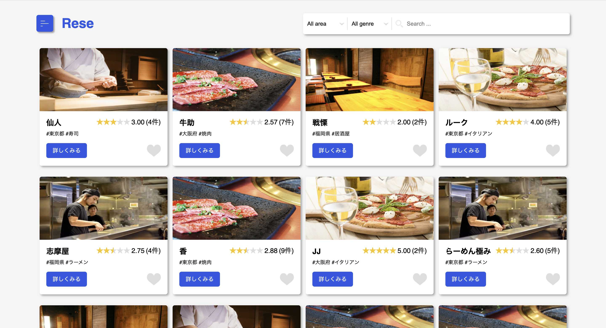
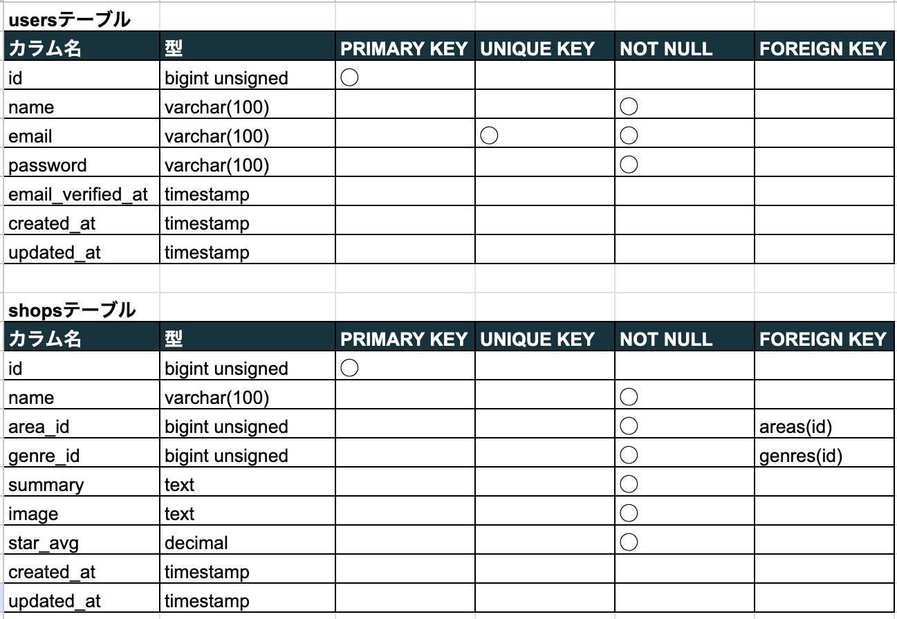
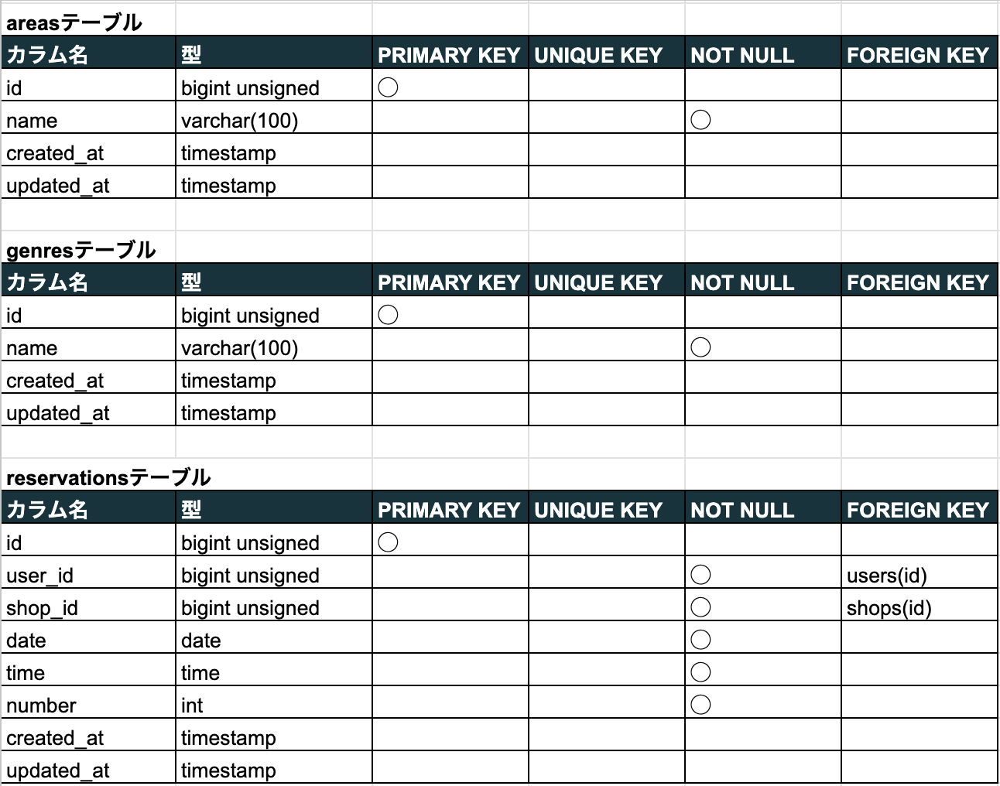
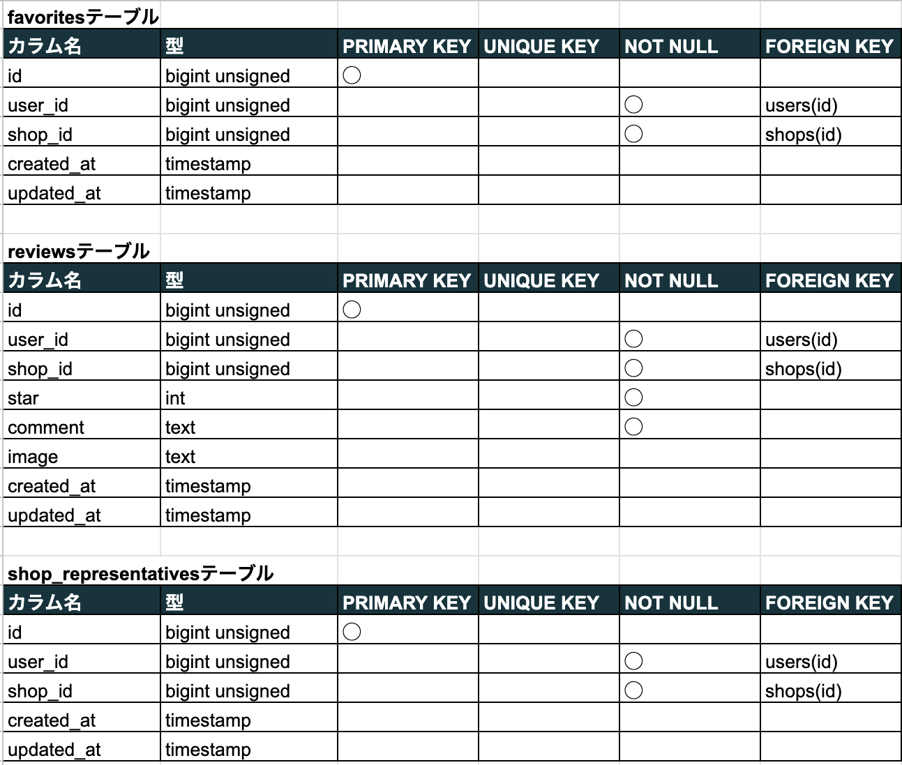
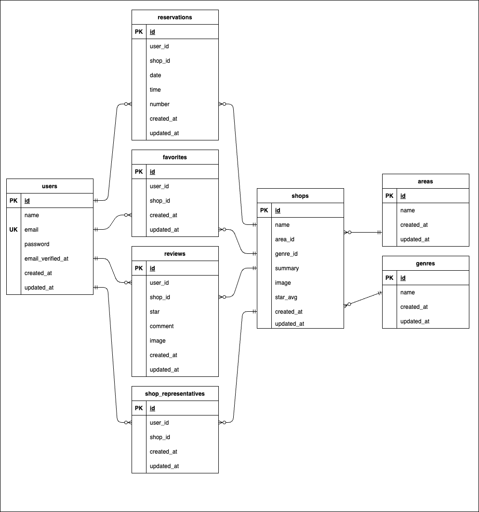

# Rese(飲食店予約サービス)

ゲストは飲食店の検索や詳細表示、会員登録するとログイン後に予約、お気に入り登録、評価投稿等ができるシステム。
管理者権限では店舗代表者の作成やお知らせメールの送信、店舗代表者権限では店舗情報の作成や予約情報の確認ができる。
また、利用者に予約情報のリマインダーを送信し、来店時のQRコードでの予約情報照合や決済も可能。



## 作成した目的

外部の飲食店予約サービスは手数料を取られるので自社で予約サービスを持ちたい為。

## アプリケーション URL

- http://13.115.241.130 (本番環境)

## 機能一覧

- 会員登録
- メール認証
- ログイン
- ログアウト
- ユーザー情報・ユーザー飲食店お気に入り一覧・ユーザー飲食店予約情報取得
- 飲食店一覧・詳細取得
- 飲食店エリア・ジャンル・店名検索
- 飲食店お気に入り追加・削除
- 飲食店予約情報追加・変更・削除
- 飲食店評価機能
- 店舗代表者作成・利用者へのお知らせメール送信(管理者権限)
- 店舗情報作成・更新と予約情報確認、QRコード読み取り機能(店舗代表者権限)
- 店舗画像をストレージに保存
- 利用者へ予約情報のリマインダー送信
- 来店時に店舗に提示するQRコードを利用者に発行
- 決済機能

## 使用技術(実行環境)

- php 7.4.9
- Laravel 8.83.8
- MySQL 8.0.26
- javascript

## テーブル設計

<br>
<br>


## ER 図



## 環境構築

**Docker ビルド**

1. `git clone git@github.com:myaa6a/rese.git`
2. DockerDesktop アプリを立ち上げる
3. `docker-compose up -d --build`

> _Mac の M1・M2 チップの PC の場合、`no matching manifest for linux/arm64/v8 in the manifest list entries`のメッセージが表示されビルドができないことがあります。
> エラーが発生する場合は、docker-compose.yml ファイルの「mysql」内に「platform」の項目を追加で記載してください_

```text
mysql:
    platform: linux/x86_64(この文追加)
    image: mysql:8.0.26
    environment:
```

**Laravel 環境構築**

1. `docker-compose exec php bash`
2. `composer install`
3. 「.env.example」ファイルを 「.env」ファイルに命名を変更。または、新しく.env ファイルを作成
4. .env で以下smtpサーバとStripeのAPIキーの設定を、使用しているアカウントの内容に変更

```text
MAIL_DRIVER=smtp
MAIL_HOST=smtp.gmail.com
MAIL_PORT=587
MAIL_USERNAME=xxxxx@gmail.com
MAIL_PASSWORD=xxxxx
MAIL_ENCRYPTION=tls
MAIL_FROM_ADDRESS=xxxxx@gmail.com
MAIL_FROM_NAME="${APP_NAME}"
```

```text
STRIPE_KEY=xxxxx
STRIPE_SECRET=xxxxx
```

5. アプリケーションキーの作成

```bash
php artisan key:generate
```

6. マイグレーションの実行

```bash
php artisan migrate
```

7. シーディングの実行

```bash
php artisan db:seed
```

**cronの登録**

リマインダーの送信を実行する為、cronを登録する

1. `crontab -e`
2. 以下の内容で登録する

```text
* * * * * php /path/to/project/artisan schedule:run 1>> /dev/null 2>&1
```

## テストユーザー

- 管理者 　　 メールアドレス: test@admin.com, パスワード: password
- 店舗代表者  メールアドレス: test@shop.com, パスワード: password
- 利用者 　　 メールアドレス: test@user.com, パスワード: password

**管理画面**

- 管理者用管理画面: 管理者でログインし、メニュー画面からAdminへ移動
- 店舗代表者用管理画面: 店舗代表者でログインし、メニュー画面からAdminへ移動

## 追加機能

- レビュー投稿時に画像を投稿でき、レビュー一覧で画像を表示できる


